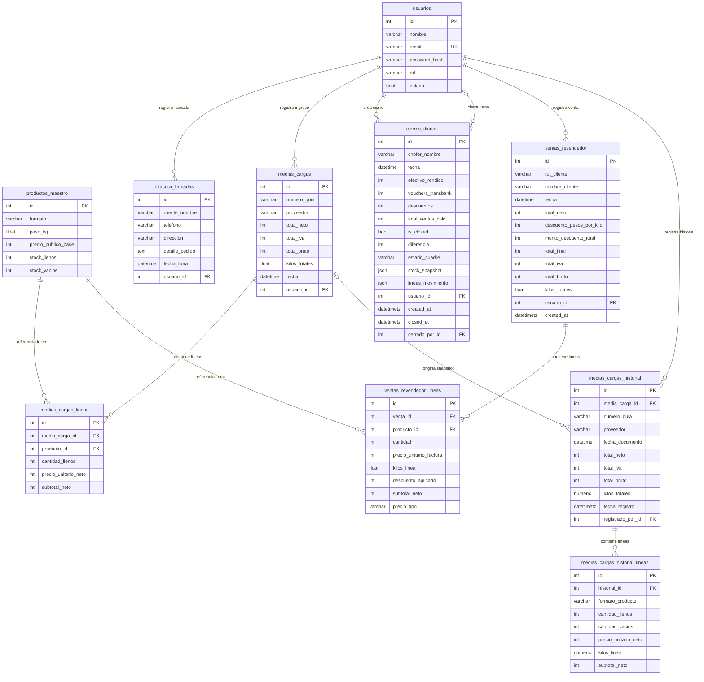

# Diagrama Entidad-Relación — Pro-Gas ERP

> **Cómo visualizar:** Pega el bloque `mermaid` en [mermaid.live](https://mermaid.live) o ábrelo directamente en VS Code con la extensión *Markdown Preview Mermaid Support*.

---

## Diagrama MER completo

---

## Descripción de tablas

### `usuarios`
Tabla central de autenticación y auditoría. Roles posibles: `operador` / `super_admin`.

| Campo | Tipo | Descripción |
|---|---|---|
| `id` | INT PK | Identificador único |
| `nombre` | VARCHAR | Nombre completo |
| `email` | VARCHAR UK | Email de inicio de sesión (único) |
| `password_hash` | VARCHAR | Hash Bcrypt — nunca texto plano |
| `rol` | VARCHAR | `operador` o `super_admin` |
| `estado` | BOOL | `true` = activo, `false` = deshabilitado |

---

### `productos_maestro`
Catálogo de formatos de gas. Gestiona stock bidireccional (llenos ↔ vacíos).

| Campo | Tipo | Descripción |
|---|---|---|
| `id` | INT PK | |
| `formato` | VARCHAR | Ej. `"5kg"`, `"11kg"`, `"45kg"` |
| `peso_kg` | FLOAT | Peso en kilogramos del formato |
| `precio_publico_base` | INT CLP | Precio de venta al público general |
| `stock_llenos` | INT | Unidades llenas en bodega (≥ 0) |
| `stock_vacios` | INT | Envases vacíos en bodega (≥ 0) |

**Restricciones:** `CHECK (stock_llenos >= 0)`, `CHECK (stock_vacios >= 0)` + `@validates` en ORM.

---

### `bitacora_llamadas`
Registro de llamadas/pedidos recibidos por operadores.

| Campo | Tipo | Descripción |
|---|---|---|
| `usuario_id` | INT FK → `usuarios` | Operador que atendió la llamada |
| `cliente_nombre` | VARCHAR | |
| `telefono` | VARCHAR | |
| `direccion` | VARCHAR | Dirección de entrega |
| `detalle_pedido` | TEXT | Descripción libre del pedido |
| `fecha_hora` | DATETIME | UTC |

---

### `medias_cargas`
Cabecera de un ingreso de gas desde proveedor. Transacción ACID con sus líneas.

| Campo | Tipo | Descripción |
|---|---|---|
| `usuario_id` | INT FK → `usuarios` | Quién registró el ingreso |
| `numero_guia` | VARCHAR | Número de guía del proveedor |
| `proveedor` | VARCHAR | Nombre del proveedor |
| `total_neto` | INT CLP | Monto sin IVA |
| `total_iva` | INT CLP | IVA (19%) |
| `total_bruto` | INT CLP | `total_neto + total_iva` |
| `kilos_totales` | FLOAT | Suma de kilos de todas las líneas |
| `fecha` | DATETIME | Fecha del documento |

---

### `medias_cargas_lineas`
Detalle de productos ingresados en una media carga. Actualiza `stock_llenos` en `productos_maestro`.

| Campo | Tipo | Descripción |
|---|---|---|
| `media_carga_id` | INT FK → `medias_cargas` | Cabecera (CASCADE delete) |
| `producto_id` | INT FK → `productos_maestro` | Producto ingresado |
| `cantidad_llenos` | INT | Unidades ingresadas |
| `precio_unitario_neto` | INT CLP | Precio factura por unidad |
| `subtotal_neto` | INT CLP | `cantidad × precio_unitario_neto` |

---

### `cierres_diarios`
Cierre de caja por turno de chofer. **Inmutable** una vez `is_closed = true`.

| Campo | Tipo | Descripción |
|---|---|---|
| `usuario_id` | INT FK → `usuarios` | Operador que creó el cierre |
| `cerrado_por_id` | INT FK → `usuarios` | Quién ejecutó el cierre (nullable) |
| `chofer_nombre` | VARCHAR | Nombre del chofer del turno |
| `fecha` | DATETIME | Fecha/hora del turno |
| `efectivo_rendido` | INT CLP | Efectivo entregado por el chofer |
| `vouchers_transbank` | INT CLP | Pagos con tarjeta |
| `descuentos` | INT CLP | Descuentos aplicados en el turno |
| `total_ventas_calc` | INT CLP | Total teórico de ventas del turno |
| `is_closed` | BOOL | `true` = cerrado, bloquea edición |
| `diferencia` | INT CLP | `(total_ventas_calc − descuentos) − (efectivo + vouchers)` |
| `estado_cuadre` | VARCHAR | `"exacto"` / `"faltante"` / `"sobrante"` |
| `stock_snapshot` | JSON | Snapshot de stock al momento del cierre |
| `lineas_movimiento` | JSON | Detalle de ventas del turno |
| `created_at` | DATETIMETZ | Timestamp de creación (server default) |
| `closed_at` | DATETIMETZ | Timestamp de cierre |

---

### `ventas_revendedor`
Venta de gas a clientes con tratado comercial. Precio calculado dinámicamente por RUT.

| Campo | Tipo | Descripción |
|---|---|---|
| `usuario_id` | INT FK → `usuarios` | Quien registró la venta |
| `rut_cliente` | VARCHAR (indexed) | RUT para buscar tratado comercial |
| `nombre_cliente` | VARCHAR | |
| `descuento_pesos_por_kilo` | INT CLP | Descuento pactado por kilo |
| `monto_descuento_total` | INT CLP | `kilos_totales × descuento/kg` |
| `total_neto` | INT CLP | Precio factura sin descuento ni IVA |
| `total_final` | INT CLP | `total_neto − monto_descuento_total` |
| `total_iva` | INT CLP | IVA 19% sobre `total_final` |
| `total_bruto` | INT CLP | `total_final × 1.19` |
| `kilos_totales` | FLOAT | Suma de kilos de todas las líneas |

---

### `ventas_revendedor_lineas`
Detalle de productos vendidos. Decrementa `stock_llenos` en `productos_maestro`.

| Campo | Tipo | Descripción |
|---|---|---|
| `venta_id` | INT FK → `ventas_revendedor` | Cabecera (CASCADE delete) |
| `producto_id` | INT FK → `productos_maestro` | Producto vendido |
| `cantidad` | INT | Unidades vendidas |
| `precio_unitario_factura` | INT CLP | Precio factura del proveedor por unidad |
| `kilos_linea` | FLOAT | `cantidad × peso_kg` |
| `descuento_aplicado` | INT CLP | Descuento por kilo aplicado a esta línea |
| `subtotal_neto` | INT CLP | Subtotal sin IVA |
| `precio_tipo` | VARCHAR | `"revendedor"` o `"publico"` |

---

### `medias_cargas_historial`
Snapshot inmutable de cada ingreso. Persiste aunque se elimine la media carga original (`SET NULL`).

| Campo | Tipo | Descripción |
|---|---|---|
| `media_carga_id` | INT FK → `medias_cargas` (SET NULL) | Referencia a origen (puede ser NULL) |
| `registrado_por_id` | INT FK → `usuarios` (RESTRICT) | Auditor (no se puede eliminar si tiene historial) |
| `numero_guia` | VARCHAR (indexed) | Copia del número de guía |
| `proveedor` | VARCHAR | Copia del proveedor |
| `fecha_documento` | DATETIME | Fecha del documento original |
| `total_neto/iva/bruto` | INT CLP | Snapshot de montos |
| `kilos_totales` | NUMERIC(10,3) | Exactitud decimal (sin IEEE-754) |
| `fecha_registro` | DATETIMETZ (indexed) | Timestamp de registro (server default) |

**Índice compuesto:** `(proveedor, fecha_registro)` — optimiza el reporte más frecuente.

---

### `medias_cargas_historial_lineas`
Detalle del snapshot. Se elimina en cascada con su historial.

| Campo | Tipo | Descripción |
|---|---|---|
| `historial_id` | INT FK → `medias_cargas_historial` (CASCADE) | |
| `formato_producto` | VARCHAR | Snapshot del formato (ej. `"11kg"`) |
| `cantidad_llenos` | INT | |
| `cantidad_vacios` | INT | |
| `precio_unitario_neto` | INT CLP | |
| `kilos_linea` | NUMERIC(10,3) | |
| `subtotal_neto` | INT CLP | |

---

## Resumen de relaciones

| Padre | Hijo | Cardinalidad | On Delete |
|---|---|---|---|
| `usuarios` | `bitacora_llamadas` | 1 → N | — |
| `usuarios` | `medias_cargas` | 1 → N | — |
| `usuarios` | `cierres_diarios` (creador) | 1 → N | — |
| `usuarios` | `cierres_diarios` (cerrador) | 0..1 → N | RESTRICT |
| `usuarios` | `ventas_revendedor` | 1 → N | — |
| `usuarios` | `medias_cargas_historial` | 1 → N | RESTRICT |
| `medias_cargas` | `medias_cargas_lineas` | 1 → N | CASCADE |
| `medias_cargas` | `medias_cargas_historial` | 0..1 → N | SET NULL |
| `medias_cargas_historial` | `medias_cargas_historial_lineas` | 1 → N | CASCADE |
| `productos_maestro` | `medias_cargas_lineas` | 1 → N | — |
| `productos_maestro` | `ventas_revendedor_lineas` | 1 → N | — |
| `ventas_revendedor` | `ventas_revendedor_lineas` | 1 → N | CASCADE |
